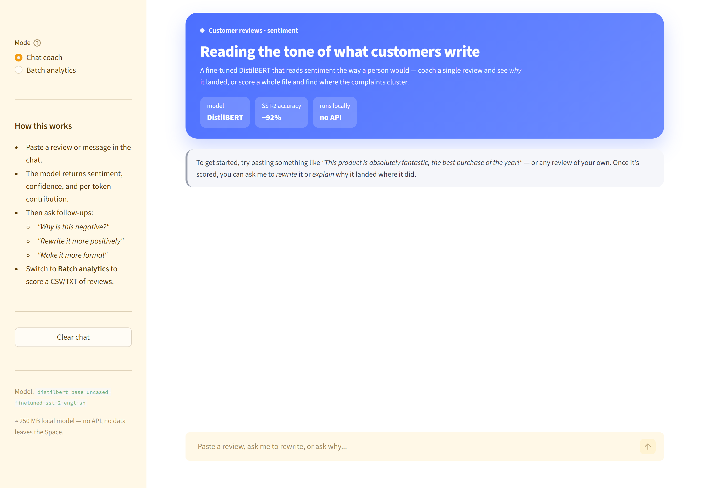

# Review sentiment

A small sentiment workbench built on a fine-tuned DistilBERT. Coach a single review (score it, explain why, rewrite it) or score a whole file at once.

<p>
  
  
  
  
  
</p>

<p align="center">
  
</p>

## What this is

A sentiment classifier on its own is a science-fair project. This one is wrapped in something a person can actually use: paste any review and you get a label, a confidence number, the words pushing it positive or negative, and a one-click rewrite into a softer or more critical tone. Upload a CSV of reviews and you get a KPI strip, an aspect-level breakdown (product / service / price / delivery / support), a 30-day rolling sentiment line, and a recommended action keyed off the worst-performing aspect.

The model is **DistilBERT** fine-tuned on SST-2, running locally inside the app — no API keys, nothing leaves the environment.

## Results

| Metric | Value |
|---|---|
| Model | DistilBERT (SST-2) |
| Accuracy | ~92% |
| Footprint | ~250 MB |
| Cost | Free — runs on CPU |

> The classical-ML notebook (`sentiment_analysis.ipynb`) is included for comparison. TF-IDF + Logistic Regression matches DistilBERT on this dataset at roughly 100× lower serving cost — the punchline being that the cheaper model is often the right answer.

## The dashboard

Two modes, switched in the sidebar:

- **Chat coach** — paste a review, get a sentiment score with a confidence gauge, ask *why?* and see the per-token contributions, ask for a rewrite (more positive, more critical, more formal) and see the new score.
- **Batch analytics** — upload a CSV or TXT, score everything in DistilBERT batches of 16, get a KPI strip, a distribution chart, an aspect breakdown, a 30-day rolling sentiment line, and a recommended action. Scored CSV is downloadable.

Per-token attribution is computed by masking each token in turn and watching the positive-class probability move — a lightweight occlusion-sensitivity method.

## Run it yourself

```bash
pip install -r requirements.txt
streamlit run dashboard.py
```

First launch downloads DistilBERT (~250 MB). After that every score is instant.

## Project layout

```
review-sentiment-engine/
├── README.md
├── requirements.txt
├── sentiment_analysis.ipynb        # classical-ML comparison notebook
├── dashboard.py
├── data/
│   └── sample_reviews.csv
└── docs/
    └── dashboard.png
```

## What I'd add next

- Swap the rule-based rewrites for a real seq2seq model (T5-small or Flan-T5) so the suggestions are grammatically tighter.
- Aspect-based sentiment from a fine-tuned model rather than a keyword lexicon.
- Shona / English code-switching support — closer to how Zim customers actually write.

---

Built by **Tadaishe Maumbe** · [@nanettetada](https://github.com/nanettetada)
